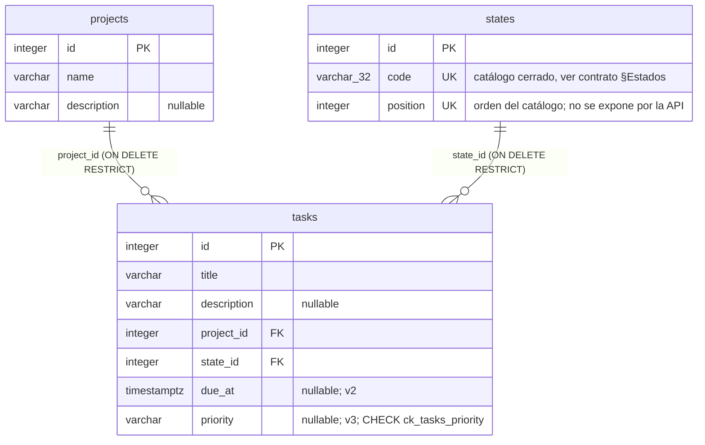

# Esquema de la base de datos

Describe el esquema físico —tablas, columnas, tipos SQL, claves y constraints—
que producen las migraciones de `alembic/versions/` aplicadas en orden. Para el
comportamiento observable de la API (códigos de estado, formas de respuesta,
orden de las listas, normalización de `title`, serialización de `due_at`,
catálogo de estados) manda [`docs/contrato-api.md`](contrato-api.md); este
documento no lo repite, lo enlaza.

Motor: PostgreSQL. El esquema se gestiona solo con Alembic; ver
[README §Migraciones](../README.md#migraciones).

## Diagrama

Cardinalidad: una tarea referencia exactamente un proyecto y exactamente un
estado (ambas columnas `NOT NULL`); un proyecto o un estado puede tener cero o
más tareas. Ninguna FK borra en cascada: `ON DELETE RESTRICT` en las dos.

## Diccionario de datos

### `states`

Creada en la revisión `0b1b461bb5d6`, junto con su seed. Es un catálogo cerrado
(ver [contrato §Estados](contrato-api.md#estados)); la API solo lee.

| Columna | Tipo | Nulos | Notas |
|---|---|---|---|
| `id` | `INTEGER` | NO | PK, generada por la base. |
| `code` | `VARCHAR(32)` | NO | `UNIQUE`. Único texto con longitud acotada del esquema (32). Valores: ver contrato §Estados. |
| `position` | `INTEGER` | NO | `UNIQUE`. Campo de orden de `GET /states` (ver [contrato §Orden de las listas](contrato-api.md#orden-de-las-listas)); **no aparece en la respuesta**. Sembrado con `enumerate(catálogo, start=1)` → 1, 2, 3, 4. |

### `projects`

Creada en la revisión `fec3ded5126e`.

| Columna | Tipo | Nulos | Notas |
|---|---|---|---|
| `id` | `INTEGER` | NO | PK, generada por la base. |
| `name` | `VARCHAR` | NO | Sin longitud máxima (ver [contrato §Convenciones](contrato-api.md#convenciones)). |
| `description` | `VARCHAR` | SÍ | Sin longitud máxima. |

### `tasks`

Creada en `08b6d37b717e` con cinco columnas; `due_at` se añadió después en
`7fe59d16aa51` y `priority` en `0ed798e1afb0`, cada una con `op.add_column`. En
el orden del catálogo de PostgreSQL, por tanto, `due_at` y `priority` van al
final, después de `state_id`.

| Columna | Tipo | Nulos | Notas |
|---|---|---|---|
| `id` | `INTEGER` | NO | PK, generada por la base. |
| `title` | `VARCHAR` | NO | Sin longitud máxima. Normalización: ver [contrato §Normalización de texto](contrato-api.md#normalización-de-texto). |
| `description` | `VARCHAR` | SÍ | Sin longitud máxima. |
| `project_id` | `INTEGER` | NO | FK → `projects.id`, `ON DELETE RESTRICT`. |
| `state_id` | `INTEGER` | NO | FK → `states.id`, `ON DELETE RESTRICT`. |
| `due_at` | `TIMESTAMP WITH TIME ZONE` | SÍ | Añadida en v2 (`7fe59d16aa51`). Semántica y serialización: ver [contrato §Tareas v2](contrato-api.md#tareas-v2-fechas-límite). |
| `priority` | `VARCHAR` | SÍ | Añadida en v3 (`0ed798e1afb0`). Restringida por `CHECK ck_tasks_priority` (abajo). Conjunto de valores: ver [contrato §Tareas v3](contrato-api.md#tareas-v3-prioridad). |

## Constraints y detalles de nivel de base

- **`CHECK ck_tasks_priority`** sobre `tasks`: `priority IS NULL OR priority IN
  ('BAJA', 'MEDIA', 'ALTA')`. Rechaza en la base cualquier valor fuera del
  conjunto, también los insertados por fuera de la API. Su `downgrade` borra
  primero la constraint y luego la columna.
- **`UNIQUE`** en `states.code` y, por separado, en `states.position`. No hay
  constraint única compuesta. El seed es idempotente por `ON CONFLICT (code) DO
  NOTHING`: se apoya en el índice único de `code`, no en el de `position`, y un
  `code` ya presente no se actualiza.
- **Sin índices sobre las columnas de FK.** Ninguna migración crea un índice
  sobre `tasks.project_id` ni `tasks.state_id`; PostgreSQL no los indexa solo
  por ser origen de una FK. Los filtros `GET /tasks?project_id=` / `?state_id=`
  y el `SELECT ... WHERE project_id` de `DELETE /projects/{id}` hacen recorrido
  secuencial.
- **`alembic_version`**: tabla de una fila (`version_num VARCHAR(32)`) que
  gestiona Alembic. Existe desde la primera revisión. `downgrade base` la deja
  vacía pero no la elimina.
- **Revisión `06d7fb2bda34`** (`base inicial vacia`): `upgrade` y `downgrade`
  son `pass`. No crea esquema; es el ancla de la cadena y el punto limpio de
  `downgrade base`.
- **Orden de creación de tablas:** `states` → `projects` → `tasks`. `states`
  precede a `projects` aunque no hay FK entre ellas; la única dependencia real
  es que `tasks` (cuarta) necesita `projects` y `states` ya creadas.

## Discrepancias

Ninguna: `app/models.py` describe las mismas columnas, tipos y claves foráneas
que aplican las migraciones.
